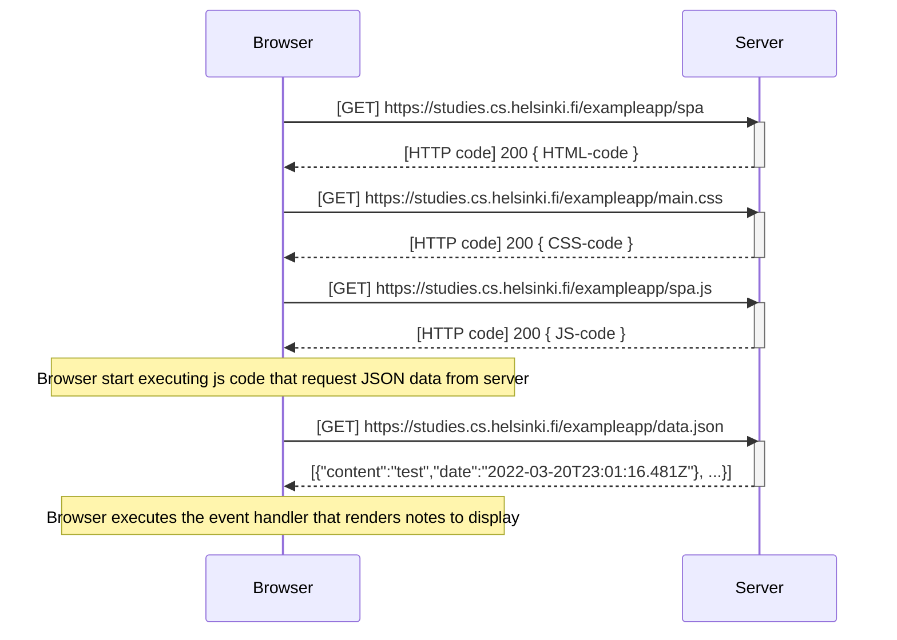
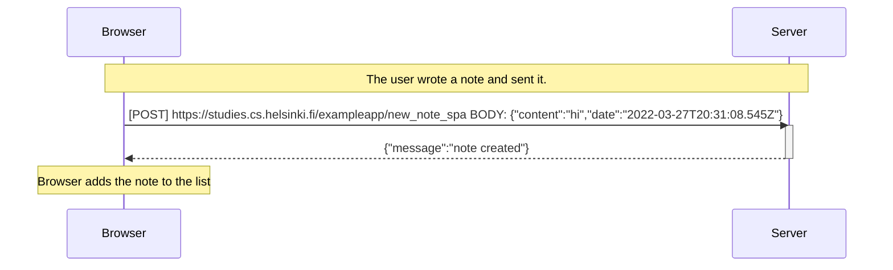

# Part 0

## Exercise 0.4: new note

Create a similar diagram depicting the situation where the user creates a new note on page https://studies.cs.helsinki.fi/exampleapp/notes when writing something into the text field and clicking the submit button.

If necessary, show operations on the browser or on the server as comments on the diagram.

The diagram does not have to be a sequence diagram. Any sensible way of presenting the events is fine.

All necessary information for doing this, and the next two exercises, can be found from the text of this part. The idea of these exercises is to read the text through once more, and to think through what is going on there. Reading the application code is not necessary, but it is of course possible.

## Exercise 0.5: Single page app

Create a diagram depicting the situation where the user goes to the single page app version of the notes app at https://studies.cs.helsinki.fi/exampleapp/spa.

## Exercise 0.6: New note

Create a diagram depicting the situation where the user creates a new note using the single page version of the app.

